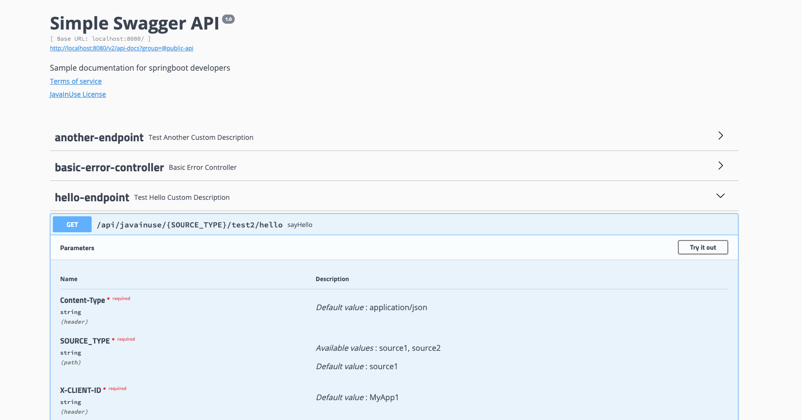

## How to customize swagger in spring boot application

Swagger provides a very nice integration with spring boot applications. Many times we want to customize the documentation built by swagger.

### Customizing the REST controllers
To customize the names of the REST controllers, use the following tags. Note that description shows as deprecated. But if you set the value details you want to show on the page, they were not picked up. May be a bug with this version of swagger.
tags attribute in @Api annotation can be used to show the 

```java
@Api(tags = "hello-endpoint",
		description = "Test Hello Custom Description",
		value = "Set of endpoints for Creating, Retrieving, Updating and Deleting of Param Defs",
		consumes = "application/json", produces = "application/json")

```


## Using the class level path params and swagger documentation

If you are defining the class level paths as defined here, there is no support in swagger to document the allowed values and details about the path parameter. 
```java
@Api(value = "Set of endpoints for Creating, Retrieving, Updating and Deleting of Param Defs",
		consumes = "application/json", produces = "application/json")
@RequestMapping(value = {"/api/javainuse/{" + SwaggerConfig.SOURCE_TYPE + "}/test2"},
		consumes = "application/json", produces = "application/json" )
@RestController
public class BaseController {


}
```

To achive defining class level path parameters we can use use the Swagger configuration and define path parameter and register it global level at the swagger Docket

```java
private Parameter buildPathParam(String name, String value, List<String> allowedValues) {
		AllowableListValues values = new AllowableListValues(allowedValues, "path");
		ParameterBuilder parameterBuilder = new ParameterBuilder();
		parameterBuilder.name(name)
				.modelRef(new ModelRef("string"))
				.parameterType("path")
				.defaultValue(value)
				.allowableValues(values)
				.required(true);
		return parameterBuilder.build();
	}


		List<Parameter> params = new ArrayList<>();
		params.add(buildPathParam(SOURCE_TYPE, "source1", Arrays.asList("source1", "source2")));

		Docket docket = new Docket(DocumentationType.SWAGGER_2).groupName("public-api").select()
				.apis(RequestHandlerSelectors.basePackage("com.javainuse.swaggertest"))
				.build().globalOperationParameters(params)
				.apiInfo(apiInfo()).select().build()
				;


```


## Swager UI 
[http://localhost:8080/swagger-ui.html?urls.primaryName=%40public-api#/hello-endpoint/sayHelloUsingGET](http://localhost:8080/swagger-ui.html?urls.primaryName=%40public-api#/hello-endpoint/sayHelloUsingGET)




## Credits

[https://www.javainuse.com/spring/boot_swagger](https://www.javainuse.com/spring/boot_swagger)

